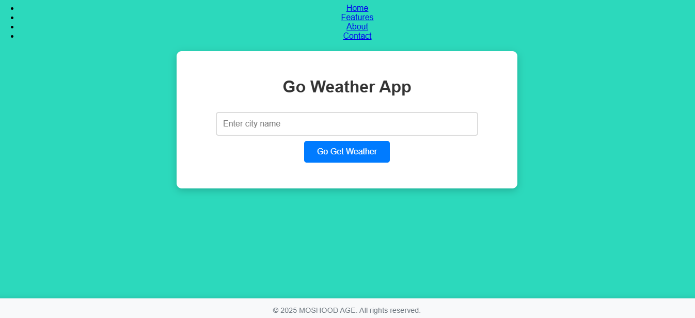

# 🌤️ **GO-Weather App**

A simple and lightweight weather application that provides **real-time temperature data** for any location using the **OpenWeatherMap API**.

---

## ✨ **Features**

- **Real-Time Temperature:** Get the current temperature for any city or region instantly.
- **Global Coverage:** Works for locations worldwide.
- **Minimalist Design:** Straightforward and easy to use—no clutter, just the info you need.

---

## 🛠️ **How It Works**

The app fetches weather data from the reliable **OpenWeatherMap API**. Simply enter a location, and it displays the **current temperature**.

---

## 🧰 **Built With**

- **Frontend:** **HTML**, **CSS**
- **Backend:** **JavaScript**
- **API:** **OpenWeatherMap API**

---

## ❓ **Why This Project?**

This is an **MVP (Minimum Viable Product)** designed to deliver one core feature: accurate temperature data. It’s a great starting point for expanding into a full-featured weather app in the future.

---

## 🚀 **Usage**

1. Enter the name of a city or location in the search bar.
2. Press "**Get Weather**" or hit **Enter**.
3. View the **current temperature** for the specified location.

---

## 🙏 **Acknowledgments**

- **ALX Africa:** A huge thank you to **ALX Africa** and all the mentors for providing an incredible learning platform where I gained valuable skills and knowledge.
- **OpenWeatherMap:** Thanks to **OpenWeatherMap** for providing the weather data API that powers this application.
